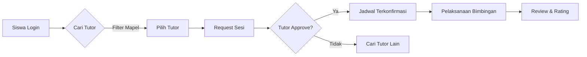

# LAPORAN PROJECT
# APLIKASI WEB MENTORIN - PLATFORM PEER TUTORING

---

**Disusun Oleh:**  
Neezar Abdurrahman Ahnaf Abiyyi

**Jurusan Rekayasa Perangkat Lunak**  
**SMK Negeri 1 Probolinggo**  
**2026**

---

## KATA PENGANTAR

Puji syukur kehadirat Tuhan Yang Maha Esa. Laporan ini disusun sebagai dokumentasi pengembangan aplikasi **MentorIn**, sebuah platform *peer tutoring* yang dirancang untuk mengatasi kesenjangan kualitas pendidikan melalui kolaborasi antar siswa. Aplikasi ini dibangun dengan teknologi modern seperti Next.js 16 dan Supabase untuk memastikan performa yang cepat dan skalabel.

---

## DAFTAR ISI

1. [BAB I - PENDAHULUAN](#bab-i---pendahuluan)
2. [BAB II - LANDASAN TEORI & TEKNOLOGI](#bab-ii---landasan-teori--teknologi)
3. [BAB III - PERANCANGAN SISTEM](#bab-iii---perancangan-sistem)
4. [BAB IV - IMPLEMENTASI & FITUR](#bab-iv---implementasi--fitur)
5. [BAB V - PENUTUP](#bab-v---penutup)

---

# BAB I - PENDAHULUAN

## 1.1 Latar Belakang Masalah

Kualitas pendidikan di Indonesia masih menghadapi tantangan serius. Berdasarkan data **PISA 2022**, skor literasi matematika siswa Indonesia turun drastis dari 379 (2018) menjadi **366**, menempatkan Indonesia di peringkat 69 dari 81 negara. Lebih mengkhawatirkan, hanya 18% siswa yang mencapai kompetensi minimum level 2, jauh di bawah rata-rata OECD sebesar 69% [1].

Salah satu solusi efektif untuk mengatasi masalah ini adalah metode **Peer Tutoring** (Tutor Sebaya). Studi di SMAN 8 Mandau menunjukkan bahwa metode ini mampu meningkatkan hasil belajar siswa hingga **50,8%** (dari rata-rata 49,17 menjadi 74,17) [2]. Selain itu, riset pada pendidikan vokasi membuktikan bahwa metode ini lebih efektif (skor 96,90) dibandingkan pembelajaran konvensional (94,29) [3].

Namun, pelaksanaan *peer tutoring* di sekolah seringkali terkendala:
1.  **Kesulitan Mencari Tutor:** Tidak ada database terpusat siapa siswa yang ahli di mapel tertentu.
2.  **Jadwal Bentrok:** Koordinasi waktu dilakukan manual dan sering *missed*.
3.  **Tidak Terukur:** Tidak ada tracking progress atau evaluasi kualitas tutor.

## 1.2 Solusi: MentorIn

**MentorIn** hadir sebagai platform web yang menghubungkan siswa yang butuh bimbingan dengan teman sebaya yang berprestasi kepandaiannya. Sistem ini mendigitalkan proses pencarian, penjadwalan, hingga evaluasi tutor dalam satu ekosistem yang terintegrasi.

## 1.3 Tujuan Project
1.  Menyediakan wadah kolaborasi akademik antar siswa yang mudah diakses.
2.  Meningkatkan rata-rata nilai akademik sekolah melalui bimbingan intensif personal.
3.  Melatih *soft skill* (komunikasi & leadership) bagi siswa tutor.

---

# BAB II - LANDASAN TEORI & TEKNOLOGI

Aplikasi ini dibangun menggunakan arsitektur *Modern Full-Stack Typescript*.

## 2.1 Core Framework
*   **Next.js 16 (App Router):** Framework React terbaru untuk performa tinggi melalui *Server Components* dan SEO optimal.
*   **TypeScript:** Superset JavaScript untuk menjamin keamanan tipe data (*type safety*) dan mengurangi bug saat runtime.

## 2.2 Database & Backend
*   **PostgreSQL (via Supabase):** Relational database yang handal untuk data kompleks.
*   **Prisma ORM:** Penghubung aplikasi dengan database yang aman *type-safe* dan mudah dimaintain.
*   **NextAuth.js v5:** Sistem autentikasi aman (mendukung OAuth & Credentials).

## 2.3 UI/UX
*   **Tailwind CSS v4:** Utility-first CSS framework untuk styling cepat dan responsif.
*   **Shadcn/UI:** Koleksi komponen UI yang *reusable* dan aksesibel.

## 2.4 Fitur Real-time
*   **Pusher:** Menangani notifikasi real-time (contoh: notifikasi request bimbingan masuk).
*   **Resend:** Layanan pengiriman email transaksional untuk verifikasi dan notifikasi.

---

# BAB III - PERANCANGAN SISTEM

## 3.1 Alur Kerja Sistem (Flowchart)

Sistem dirancang sesederhana mungkin untuk memudahkan pengguna:

## 3.2 Diagram Database (ERD Sederhana)

*   **User:** Menyimpan data login, role (Student/Tutor), dan profil.
*   **TutorProfile:** Detail keahlian, jadwal, dan rating tutor.
*   **Request:** Data permintaan bimbingan (status: Pending, Approved, Done).
*   **Review:** Ulasan dan rating setelah sesi selesai.

---

# BAB IV - IMPLEMENTASI & FITUR

## 4.1 Fitur Unggulan

1.  **Smart Matching:** Pencarian tutor berdasarkan mata pelajaran, rating, dan ketersediaan waktu.
2.  **Real-time Booking:** Request jadwal bimbingan langsung dengan status update instan.
3.  **Tutor Verification:** Sistem verifikasi manual oleh admin untuk menjamin kualitas tutor.
4.  **Analytics Dashboard:** Grafik perkembangan jumlah sesi dan pengguna untuk admin.

## 4.2 Tampilan Aplikasi

*(Bagian ini ditiadakan sesuai instruksi)*

---

# BAB V - PENUTUP

## 5.1 Kesimpulan
MentorIn berhasil dikembangkan sebagai solusi digital untuk masalah kesenjangan akademik di sekolah. Dengan fitur pencarian tutor dan penjadwalan terintegrasi, aplikasi ini mempermudah implementasi metode *Peer Tutoring* yang terbukti efektif meningkatkan nilai siswa. Penggunaan teknologi Next.js 16 menjamin aplikasi berjalan cepat, responsif, dan siap digunakan dalam skala besar.

## 5.2 Saran Pengembangan
Untuk pengembangan selanjutnya, disarankan menambahkan fitur **Video Call in-app** menggunakan **WebRTC** agar bimbingan online bisa dilakukan langsung di dalam platform tanpa aplikasi pihak ketiga.

---

### DAFTAR PUSTAKA

[1] OECD. (2023). *PISA 2022 Results: The State of Learning and Equity in Education*. Paris: OECD Publishing.  
[2] Jurnal Pendidikan. (2024). *Efektivitas Tutor Sebaya terhadap Hasil Belajar Geografi Siswa SMAN 8 Mandau*.  
[3] ResearchGate. (2023). *Pengaruh Peer Tutoring pada Pembelajaran Vokasi*.  
